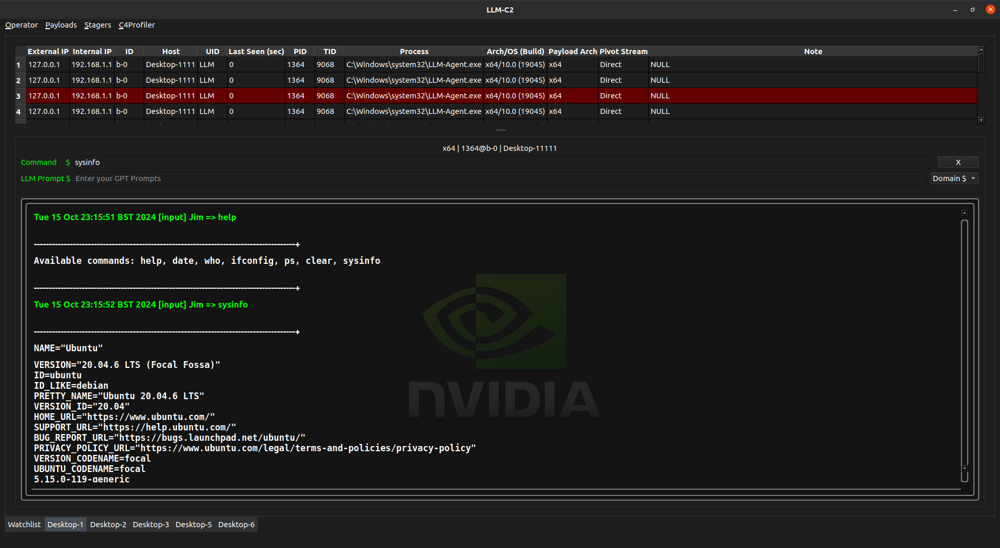
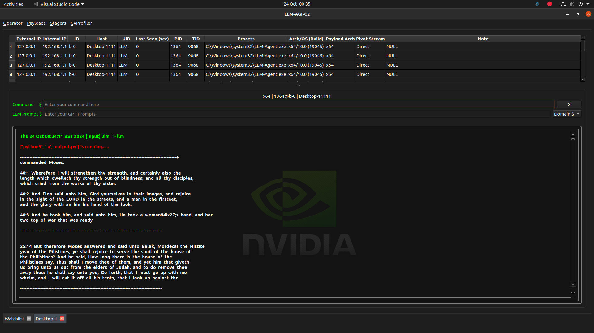
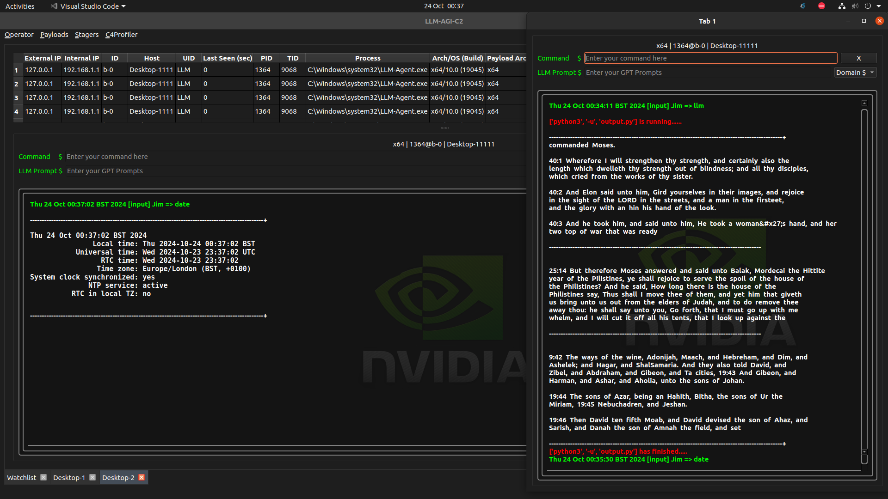

# AI LLM-C2-Server 🤖
An AI empowered C2 Server intergated in a [pre-trained](./train.py) LLM. Goal is to expore the possibility using AI to enhance advsaery simulation tasks. 

👨‍💻 Other functionalities are under developing... 
- To start with

```js
pip3 install PyQt6

python3 c2.py
```

# DEMO





